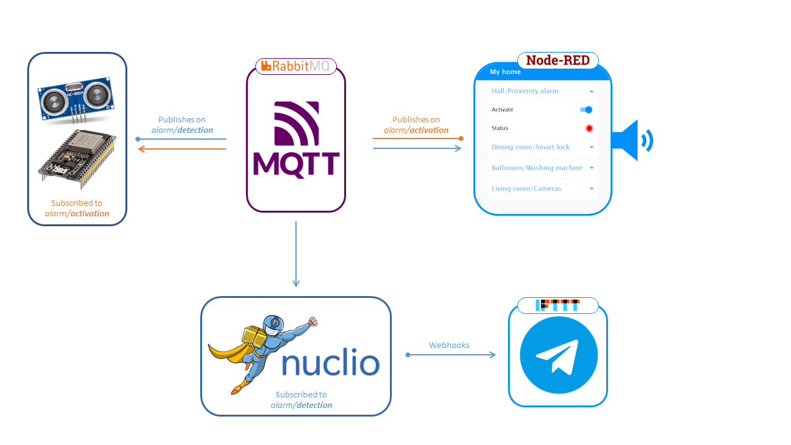

# Proximity alarm

## Introduction
**Proximity alarm** is an alarm system that detects the closeness of someone or something to the **ultrasonic sensor**. This type of system can be used to make your locker a safe and smart place: placing it near the locker, it can be used to detect and signal you the presence of enemy people, by **Telegram** and also by a **voice message** from the dashboard. Of course, when you have to use the locker, you can previously turn off the sensor from the dashboard and prevent the ringing voice of Google assistant from stressing your ears.

When no one is in the **alarm range** **(5 cm)**, the system lights a green LED (if activated). Only in the event that someone comes closer than 5 centimeters to the proximity sensor, the system notifies the user through a voice message, the lighting of a red LED and an alert message via Telegram.




For this project, _a MQTT Broker_ (via _RabbitMQ_) is executed over the _Docker_ container to easily deploy it in production. When the system detects the closeness of someone in the alarm range, it publishes a message via MQTT that activates:
- a _Nuclio_ function, invoked using a RabbitMQ trigger that works as subscriber to the specific topic. It also executes an HTTP request to the _IFTTT WebHook_ that sends an alert message on Telegram.
- 2 _Node-RED_ triggers that turn on the red LED and enable the voice message of the Google assistant on the dashboard. 

## Project structure
**1. Function**:
- :spiral_notepad: `detection_handler.js` : Nuclio function that is executed when someone is in the alarm range; 
- :spiral_notepad: `yaml/detection_handler.yaml` : contains all the deploying informations of the function on Nuclio.
  
**2. Sensor**:
- :spiral_notepad: `ultrasonic_sensor.ino` : script executed on Esp32 board, used for people detection.

**3. Node-RED**:
- :spiral_notepad: `flow/proximityAlarmFlow.json`: flow used to simulate the dashboard of a home automation app.

## Getting started
### Docker :whale2:
Docker is an open platform for developing, shipping, and running applications. Docker enables you to separate your applications from your infrastructure so you can deliver software quickly.

Install Docker following this [guide](https://docs.docker.com/get-docker/).

### RabbitMQ :rabbit:	
RabbitMQ is a message-queueing software also known as a message broker or queue manager. It supports multiple messaging protocols: _MQTT_ is the one used for this project.

You can start a RabbitMQ instance with Docker running this command:
```
docker run -p 9000:15672  -p 1883:1883 -p 5672:5672  cyrilix/rabbitmq-mqtt 
```

Then you can browse to http://localhost:9000, and login with `guest` as username and `guest` as password, to  access to the RabbitMQ dashboard.

### Nuclio :superhero_man:
Nuclio is an open source and managed serverless platform used to minimize development and maintenance overhead and automate the deployment of data-science based applications.

You can start a Nuclio instance with Docker running this command:
```
docker run -p 8070:8070 -v /var/run/docker.sock:/var/run/docker.sock -v /tmp:/tmp nuclio/dashboard:stable-amd64
```

Then you can browse to http://localhost:8070 to access to the Nuclio dashboard.

### Node-RED :bookmark:
Node-RED is an open-source programming tool, for connecting hardware devices, APIs and online services creatively and easily. Primarily, it is a visual tool designed for the _Internet of Things_.

You can start a Node-RED instance with Docker running this command:
```
docker run -it -p 1880:1880 -v node_red_data:/data --name mynodered nodered/node-red
```

Then you can browse to http://localhost:1880 to access to the Node-RED dashboard.

### IFTTT :leftwards_arrow_with_hook:
IFTTT is a free web service and mobile app that helps users automate web-based tasks and boost productivity by making popular apps work together.

You have to register [here](https://ifttt.com/join).

## And now what?

1. Register on _IFTTT_ and [create](https://ifttt.com/create) a new `applet` in this way:
   - Select _Webhooks_ as `IF` action, select _Receive a web request_ and type "_detection_trigger_" in `Event Name`.
   - Select _Telegram_ as `THEN` reaction, select _Send a message_, connect your Telegram account and choose the message in `Message text`. Click on `Create`, then on `Finish`.
   - From your [_applet documentation_](https://ifttt.com/maker_webhooks), you have to save your _request url_ and _IFTTTkey_ for the 3rd step.
2. Start your _RabbitMQ_, _Nuclio_ and _Node-RED_ instances.
3. Browse to http://localhost:8070 to access to the Nuclio dashboard.
   - Create a new project named _serverlessproj_;
   - Click on the newly created project and then on `Import` to upload a _YAML_ file. So upload `detection_handler.yaml` from `yaml` folder;
   - Click on `Create`. Go to the `Code` tab and change the _IFTTTkey_, the _url_ and the _request url_ (saved from Step1);
   - Click on `Deploy`. :pray:
4. Browse to  http://localhost:1880 to access to the Node-RED dashboard. 
   - From the hamburger menu at the top right, click on `Manage palette`, go to the `Install` tab and search for:
   ```
   node-red-contrib-ui-led
   ```
   ```
   node-red-dashboard
   ```
   - From the hamburger menu at the top right, click on `Import` and upload `proximityAlarmFlow.json` from `flow` folder;
   - In the newly imported flow, there are _2 MQTT nodes_: update the MQTT properties of both;
   - Click on `Deploy`.
5. Start your `Arduino IDE` and install the ESP32 board with this [guide](https://randomnerdtutorials.com/installing-the-esp32-board-in-arduino-ide-windows-instructions/).
   - Open `ultrasonic_sensor.ino`, so connect your ESP32 module with usb-c wire in the port. 
   - Configure `mqtt_server` and `mqtt_port` according with your MQTT Broker and set `ssid` and `password` according to your WiFi credentials;
   - Select the right board from `Tools`>`Board`>`Esp32 Arduino`>`AI-Thinker ESP32 Cam`, then select the right port;
   - You are ready to `Verify` and `Upload` the sketch.
6. Try it!
   
